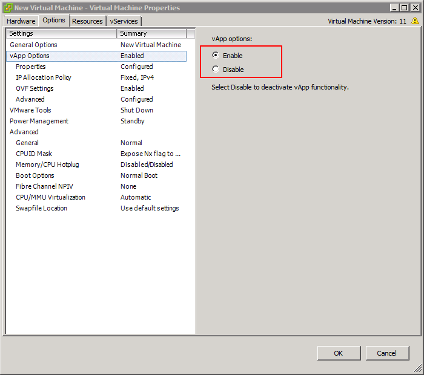

# VMWare OVF with properties and deployment-option

This is a tool to build vmware ovf with properties and deployment-option.

# How create a OVF template

1. Login VCenter 6.0+
2. Click `New Virtual Machine`, configure all hardware, Save it.
3. Don't power on this VM.
4. Click `edit virtual machine setting`
5. add more disks, network adapters, etcs
6. Add a small iso into CDROM, and selected `connect at power on`

7. On tab `Options`, enable `vApp Options`

8. Goto `vApp Options/OVF Setting`, enable `VMWare Tools` under `OVF Envirnment Transport`
9. Goto `vApp Options/Advanced`, Add more customized propeties

10. Export OVF

> Notes: selected iso file will be exported, so choice a small iso for template.

# Add deployment-options

`deployment-option` does not support for vCerter UI,
so you shoud manually update ovf file according samples.

# Getting OVFTOOL

https://www.vmware.com/support/developer/ovf/
