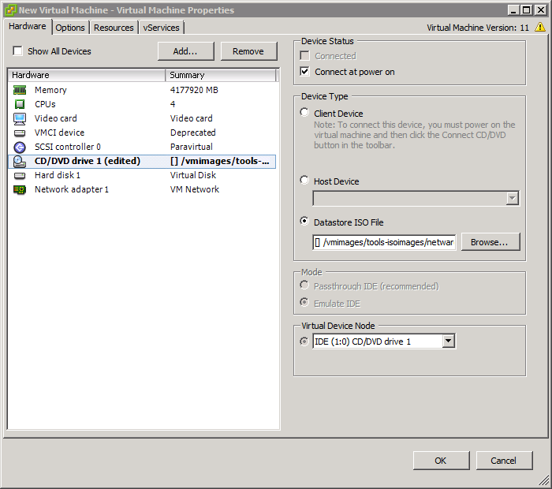
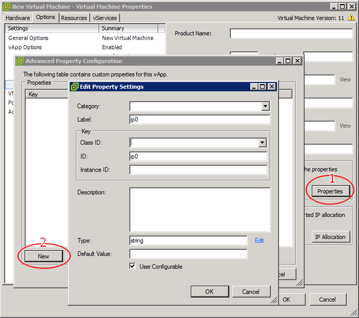

# VMWare OVF with properties

This is a tool to build a OVF/OVA with centos-kickstart.iso and apply vmware ovf properties.

```bash
./run.sh ~/KS_CentOS-7-x86_64-Minimal-1708.iso
```

# How create a OVF template

1. Login VCenter 6.0+
2. Click `New Virtual Machine`, configure all hardware, Save it.
3. Don't power on this VM.
4. Click `edit virtual machine setting`
5. add more disks, network adapters, etcs
6. Add a small iso into CDROM, and selected `connect at power on`

7. On tab `Options`, enable `vApp Options`

8. Goto `vApp Options/OVF Setting`, enable `VMWare Tools` under `OVF Envirnment Transport`
9. Goto `vApp Options/Advanced`, Add more customized propeties

10. Export OVF

> Notes: selected iso file will be exported, so choice a small iso for template.

# Getting OVFTOOL

https://www.vmware.com/support/developer/ovf/

# Exports OVA

```
ovftool --skipManifestCheck centos-7-kickstart.ovf centos-7-kickstart.ova
```
